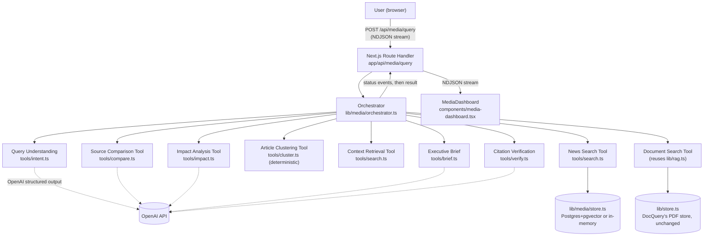
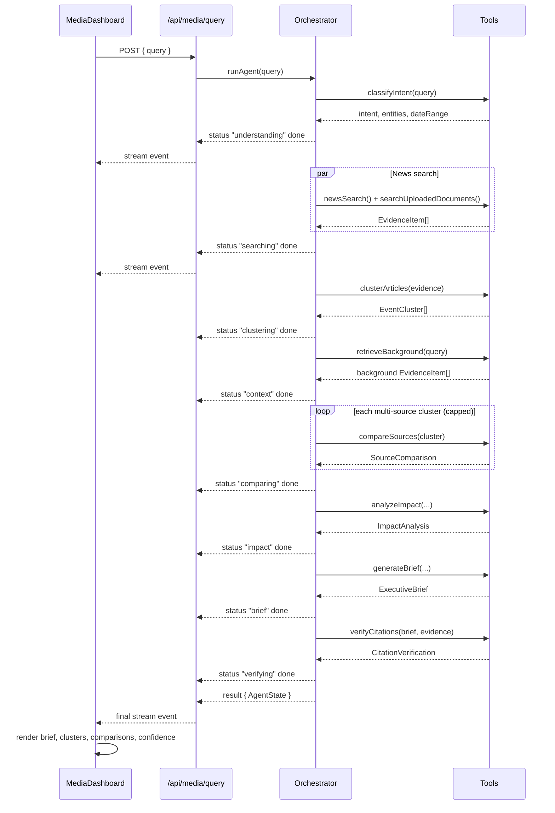
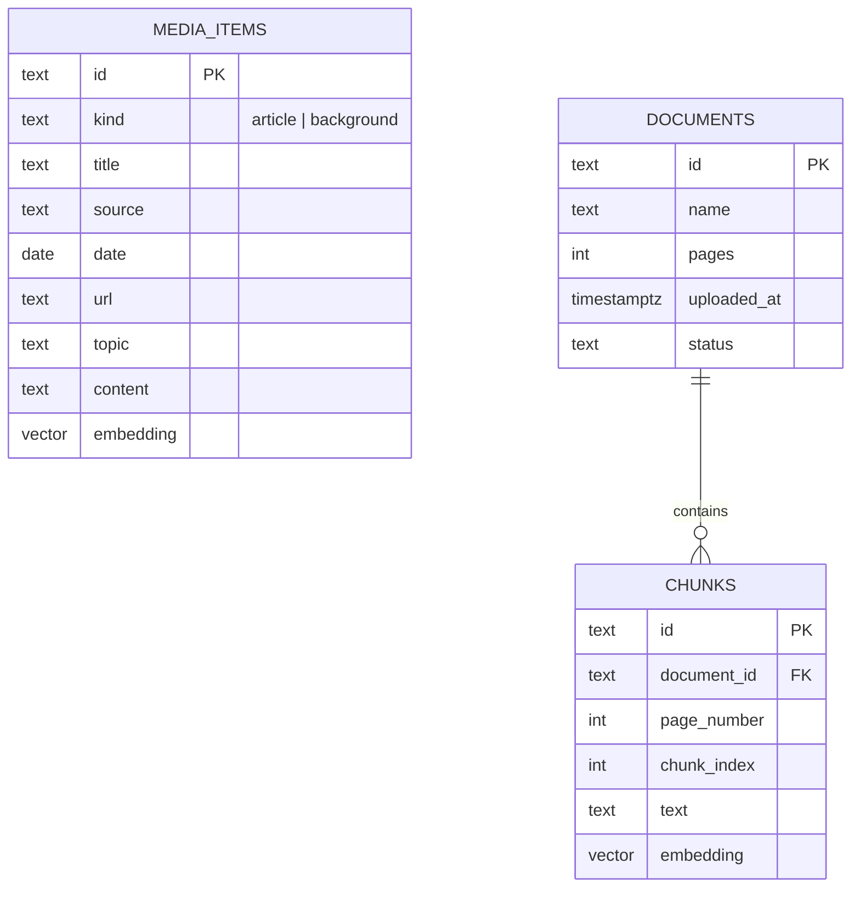

# Architecture — Executive Media Intelligence Agent

## System overview

## Pipeline sequence

## Why a fixed pipeline, not a free-form agent loop

The product spec explicitly warns against "unnecessary autonomous complexity." A ReAct-style loop where the model picks its own next tool call would make behavior harder to predict, harder to bound in cost/latency, and harder to test (the evaluation harness assumes each step runs in a known order). Instead:

- **Every step runs in the same order** for any non-empty evidence set — this is what "explainable" means here: you can point at `orchestrator.ts` and read the exact sequence of tool calls that produced any given brief.
- **Query-understanding output *does* steer the pipeline**, just narrowly: `intent.dateRange` filters the news search, and `intent.intent` is surfaced as a UI label. This is the "planner decides which tools are necessary" requirement, kept lightweight rather than expanded into full dynamic tool selection.
- **Extension point for more dynamic behavior**: `runAgent()` in `lib/media/orchestrator.ts` is the single place to add, for example, skipping the comparison/impact/brief steps entirely for a single-cluster "summarize" intent and returning a shorter direct answer instead. Not implemented in this prototype to keep the pipeline predictable and testable; noted here rather than half-implemented.

## Data model

`media_items` (this feature) and `documents`/`chunks` (DocQuery, unchanged) are independent tables in the same Postgres database when `DATABASE_URL` is set — they never join or share rows. `lib/media/tools/search.ts`'s `searchUploadedDocuments` bridges them at the application layer by wrapping both result shapes in a common `EvidenceItem` type, not at the database layer.

## Retrieval tuning (measured, not assumed)

Cosine similarity between `text-embedding-3-small` embeddings does not cleanly separate "genuinely relevant" from "topically adjacent but off-topic" for short news text. Measured against the sample dataset (see `lib/media/tools/search.ts` for the script this came from):

| Query | Top match | Median (top 24) | Min |
|---|---|---|---|
| "Major developments in India's renewable energy sector" (on-topic) | 0.592 | 0.420 | 0.237 |
| "India's nuclear energy capacity target" (off-topic — not in dataset) | 0.504 | 0.313 | 0.216 |

The off-topic query's best match (0.504) scores *higher* than the on-topic query's median (0.420) — a single similarity threshold cannot fully separate the two. `newsSearch`'s default `minSimilarity` (0.28) trims the weakest noise but is not, by itself, a reliable "is this relevant" gate. **The brief-writing prompt is what is responsible for the honest "evidence insufficient" behavior** (tested in evaluation case T14) — it is instructed to say so explicitly when the retrieved evidence doesn't address the question, rather than relying on retrieval alone to return nothing.

## Confidence score

Computed deterministically in `orchestrator.ts` from the citation-verification pass, not a separate LLM call:

1. Start from the fraction of extracted claims whose citations both exist in evidence and were judged supported on re-check.
2. Subtract up to 0.2 total for unresolved cross-source conflicts (0.05 per conflict, capped).
3. Clamp to `[0, 1]`.
4. Attach human-readable notes for every factor that reduced it (fabricated citations, unsupported claims, conflicts, single-source developments).

This keeps confidence auditable — every point it lost is listed in `confidenceNotes`, rather than being an opaque model-generated number.
